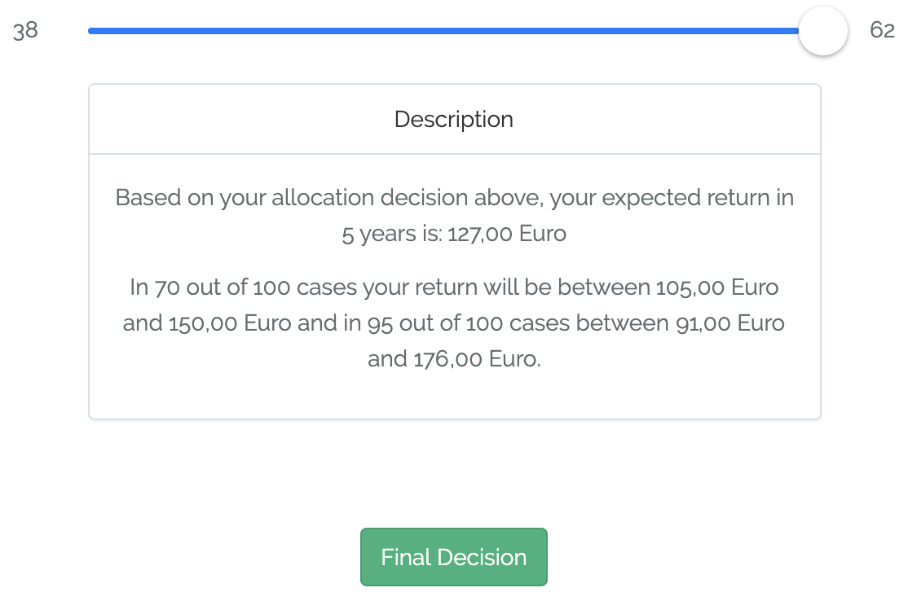
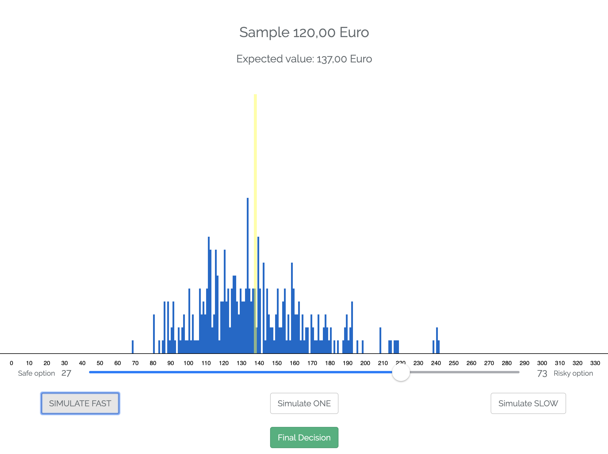
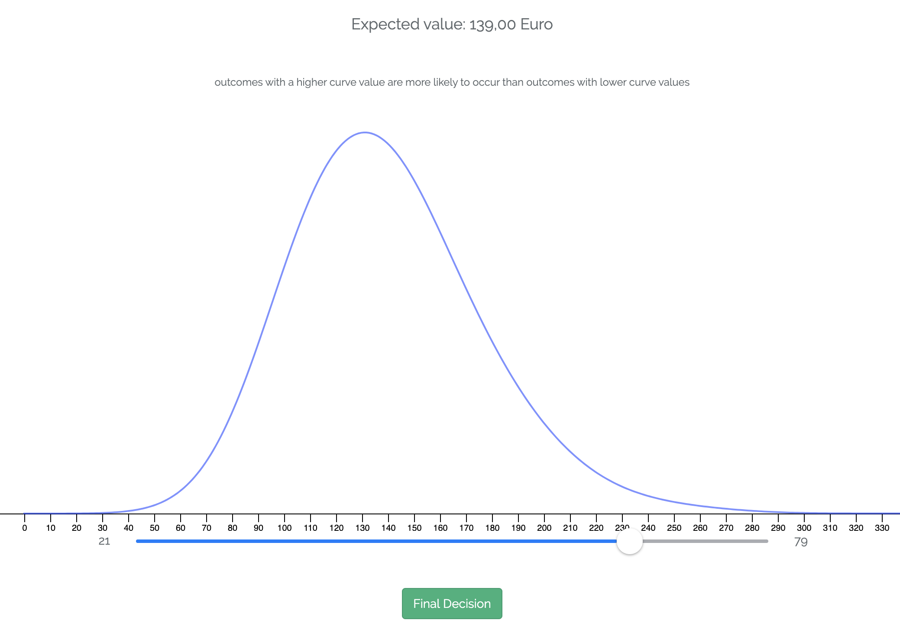
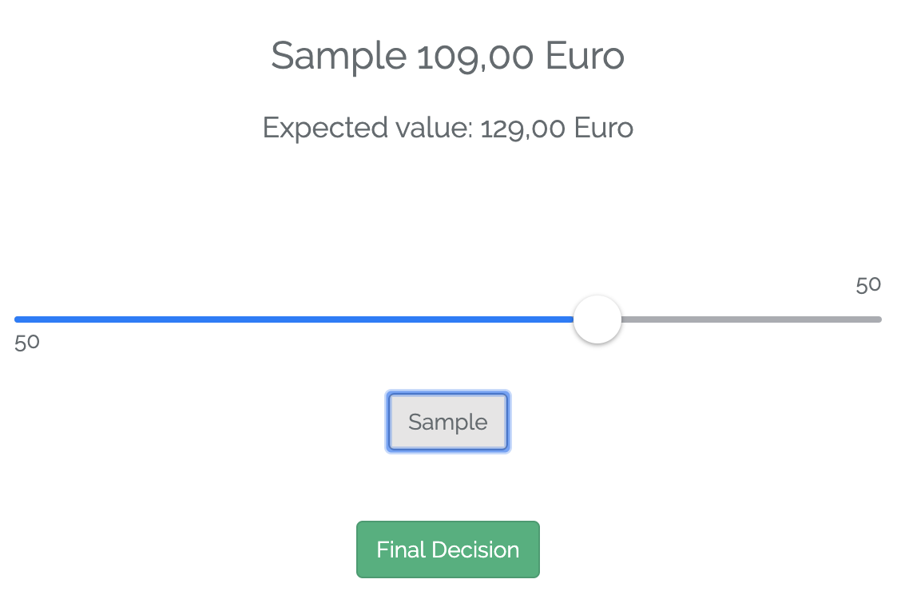

 

### I The description-experience gap 

  

#### Interactive - 5min

Go to this <a href="https://taming-uncertainty.mpib-berlin.mpg.de/chapter-7-element-1">**site**</a> to try out risky choices based on experience and description. **Don't sample for too long**. 

 

### II Harnessing simulated experiences 

  

#### Interactive 1 - 20min

Go to this <a href="https://taming-uncertainty.mpib-berlin.mpg.de/chapter-7-element-1">**site**</a> to explore the cognitive underpinnings of decisions from experience. 

When you think you have found the best mix of cognitive components go to this <a href="https://docs.google.com/forms/d/e/1FAIpQLSc7Xrw6d8XdZR1D5bl1Aqwr-6fcEwarEqOwgNx0RGgPiQtm3w/viewform?usp=sf_link">**survey**</a> to enter your predictions.

#### Interactive 2 - 20min

Try out each of the risk intervention tools below (simply click on them). Only explore the tool. **Don't bother answering the questions** posed to after you've made the decisions. 

<table style="margin-bottom:10px">
  <tr>
    <td style="padding:4px">
    
Description

    
    </td>
    <td style="padding:4px">
    
Risk tool

    
    </td>
    <td style="padding:4px">
    
Distribution

    
    </td>
    <td style="padding:4px">
    
Experience

    
    </td>
  </tr>
</table>

When you have explore all risk intervention tools, go to this <a href="">**survey**</a> to share your impression on each of the tools.  

